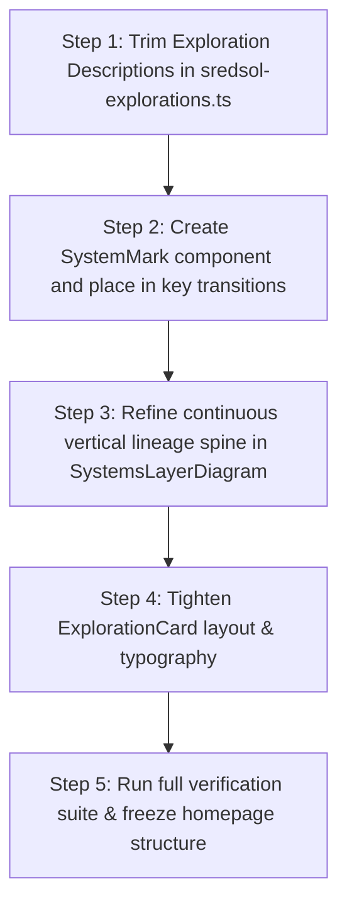

# SREDSOL Homepage Finalization Plan
## Trimming Studio Copy, Continuous Lineage Spine & SREDSOL Signature Grammar

> **Document Target**: [`devdocs/homepage-finalization-plan.md`](file:///Users/shsarma/DEVEL/TESTING/astro-emdash-sqlite-r2-starter/devdocs/homepage-finalization-plan.md)  
> **Source Review**: [`devdocs/reviews/after-semantics.md`](file:///Users/shsarma/DEVEL/TESTING/astro-emdash-sqlite-r2-starter/devdocs/reviews/after-semantics.md) (Assessment: 9.2/10)  
> **Strategic Objective**: Freeze 90% of the visual layout and execute 4 surgical refinements to finalize the homepage structure.

---

## 1. Executive Summary: The 4 Target Refinements

```
┌─────────────────────────────────────────────────────────────────────────────┐
│                    HOMEPAGE FINALIZATION WORK PACKAGES                      │
├─────────────────────────────────────────────────────────────────────────────┤
│  WP-1: TRIM STUDIO CARD COPY       WP-2: CONTINUOUS LINEAGE SPINE           │
│  ───────────────────────────       ──────────────────────────────           │
│  Enforce 1 sentence + metadata     Solid continuous vertical spine with     │
│  + action. Let 2×2 grid breathe.   active node indicators (● 01 → ● 07).    │
│                                                                             │
│  WP-3: UNIFIED NODE/WIRE GRAMMAR   WP-4: SREDSOL SIGNATURE MOTIF            │
│  ───────────────────────────────   ─────────────────────────────            │
│  Re-use common node/wire tokens    Subtle recurring node+signal+wire        │
│  across Pillars, Conduit & Lineage.glyph (·──────●──────· \ \ ●) in dividers.│
└─────────────────────────────────────────────────────────────────────────────┘
```

---

## 2. Detailed Work Packages

### WP-1: Trim Studio Card Copy & Clean 2×2 Rhythm
* **Target Files**:
  - [`src/emdash/sredsol-explorations.ts`](file:///Users/shsarma/DEVEL/TESTING/astro-emdash-sqlite-r2-starter/src/emdash/sredsol-explorations.ts)
  - [`src/components/ui/data-display/ExplorationCard/ExplorationCard.astro`](file:///Users/shsarma/DEVEL/TESTING/astro-emdash-sqlite-r2-starter/src/components/ui/data-display/ExplorationCard/ExplorationCard.astro)
* **Actions**:
  1. **Trim Descriptions to One Clear Sentence**:
     - *Physical Computing*: *"Interactive computational environment for constructing and testing physical hardware-software systems."*
     - *LearningOS*: *"Constructivist cognitive workbench for modeling complex concepts through dynamic computational simulations."*
     - *Observation Studio*: *"Scientific instrumentation platform for streaming live time-series telemetry and spectral analysis."*
     - *OxiGeo & MathArt*: *"Generative mathematical workbench transforming topological equations into interactive computational forms."*
  2. **Tighten ExplorationCard Typography & Spacing**:
     - Reduce description vertical padding and ensure relationship rows (`EXPLORES`, `USES`, `RELATED`) are compact and easily scannable.

---

### WP-2: Continuous Lineage Spine in "Mathematics to Empirical Understanding"
* **Target Files**:
  - [`src/components/sections/SystemsLayerDiagram.astro`](file:///Users/shsarma/DEVEL/TESTING/astro-emdash-sqlite-r2-starter/src/components/sections/SystemsLayerDiagram.astro)
  - [`src/components/ui/layout/SystemLayer/SystemLayer.astro`](file:///Users/shsarma/DEVEL/TESTING/astro-emdash-sqlite-r2-starter/src/components/ui/layout/SystemLayer/SystemLayer.astro)
* **Actions**:
  1. **Solid Continuous Vertical Spine**:
     - Establish a continuous `2px` vertical spine running uninterrupted from Step 01 to Step 07.
     - Place glowing active node anchors (`● 01`, `● 02`, etc.) with state-colored rings.
  2. **Active Flow Signals**:
     - Animate a subtle data-pulse traveling top-to-bottom along the spine to visually reinforce the directional conduit.

---

### WP-3: Unified Node/Wire Grammar Across Sections
* **Target Files**:
  - [`src/components/sections/DomainGrid.astro`](file:///Users/shsarma/DEVEL/TESTING/astro-emdash-sqlite-r2-starter/src/components/sections/DomainGrid.astro)
  - [`src/components/sections/EditorialManifesto.astro`](file:///Users/shsarma/DEVEL/TESTING/astro-emdash-sqlite-r2-starter/src/components/sections/EditorialManifesto.astro)
  - [`src/components/sections/SystemsLayerDiagram.astro`](file:///Users/shsarma/DEVEL/TESTING/astro-emdash-sqlite-r2-starter/src/components/sections/SystemsLayerDiagram.astro)
* **Actions**:
  1. **Consistent Visual Language**:
     - Unify font sizes for all domain badges (`01 // COMP`, `02 // PHYS`, `03 // OBS`, `04 // LEARN`).
     - Standardize border radii and hairline divider tokens across all 3 structural sections.

---

### WP-4: SREDSOL Signature Mark (`node + signal + grid`)
* **Target Files**:
  - [`src/components/ui/data-display/SystemMark/SystemMark.astro`](file:///Users/shsarma/DEVEL/TESTING/astro-emdash-sqlite-r2-starter/src/components/ui/data-display/SystemMark/SystemMark.astro) (New Component)
  - [`src/components/sections/EditorialManifesto.astro`](file:///Users/shsarma/DEVEL/TESTING/astro-emdash-sqlite-r2-starter/src/components/sections/EditorialManifesto.astro)
  - [`src/components/layout/Footer.astro`](file:///Users/shsarma/DEVEL/TESTING/astro-emdash-sqlite-r2-starter/src/components/layout/Footer.astro)
* **Actions**:
  1. **Create Reusable SystemMark Component**:
     - Render an SVG / CSS geometric glyph depicting a connected bus with node junction:
       $$\cdot\text{──────}\bullet\text{──────}\cdot \quad \searrow \quad \bullet$$
  2. **Subtle Placements**:
     - Insert delicately above the Editorial Manifesto and inside the footer brand block as an unmistakable signature mark.

---

## 3. Implementation Sequence & Quality Gates



---

## 4. Verification Checklist

- [ ] `node scripts/validate-i18n.js`
- [ ] `node scripts/check-kpis.mjs`
- [ ] `npx stylelint "src/styles/**/*.css"`
- [ ] `npx vitest run`
- [ ] `ASTRO_TELEMETRY_DISABLED=1 npx astro check`
- [ ] `ASTRO_TELEMETRY_DISABLED=1 npx astro build`
