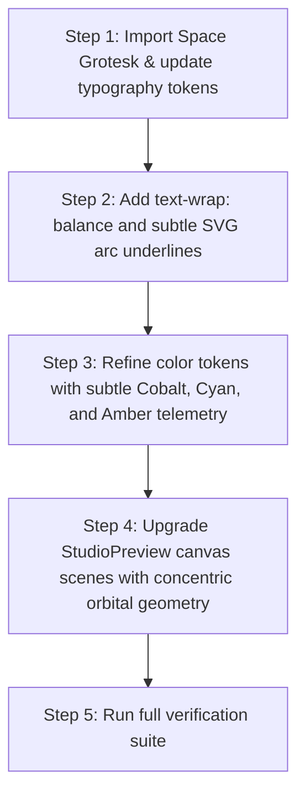

# SREDSOL Subtle Computational Aesthetic Refinement Plan
## Incorporating Space Grotesk Typography, Orbital Geometry & Refined Micro-Interactions

> **Document Target**: [`devdocs/kepler-aesthetic-refinements.md`](file:///Users/shsarma/DEVEL/TESTING/astro-emdash-sqlite-r2-starter/devdocs/kepler-aesthetic-refinements.md)  
> **Brand Identity Foundation**: [sredsol.com](https://sredsol.com) (Calm, scholarly, computational systems laboratory)  
> **Inspiration Source**: [Astro Kepler](https://astro-kepler.pages.dev) (Typography, text balancing, orbital geometry)  
> **Core Proposition**: *“Technology for Exploration — We build systems that make exploration possible.”*

---

## 1. Executive Strategy: Subtle Computational Aesthetics

```
┌─────────────────────────────────────────────────────────────────────────────┐
│                 SREDSOL SUBTLE COMPUTATIONAL DESIGN SYSTEM                  │
├─────────────────────────────────────────────────────────────────────────────┤
│  OLD SREDSOL FOUNDATION                 KEPLER INSPIRATION (SELECTIVE)      │
│  ──────────────────────                 ──────────────────────────────      │
│  • Deep Slate & Carbon dark canvas      • Space Grotesk display typography  │
│  • Scholarly Royal Cobalt / Indigo      • Modern text-wrap: balance         │
│  • Muted scientific instruments         • Orbital concentric motion tracks  │
│  • Clean hairline grids & scopes        • Subtle keyword vector arc accents │
│                                                                             │
│                        ▼ SYNTHESIZED RESULT ▼                               │
│  A calm, high-precision computational laboratory experience with subtle     │
│  tones, refined typography, and organic orbital physics. No neon or pop.    │
└─────────────────────────────────────────────────────────────────────────────┘
```

---

## 2. Subtle Color Token Matrix

We reject aggressive pop-orange banners and cartoon shadows in favor of a **muted, high-legibility computational palette**:

| Semantic Token | Exact Value / Hex | Usage in SREDSOL |
| :--- | :--- | :--- |
| **`--background`** | `#0a0f1d` (Dark) / `#f8fafc` (Light) | Atmospheric deep canvas with subtle spatial radial fade |
| **`--card`** | `#111827` (Dark) / `#ffffff` (Light) | Instrument panels, studio cards, and digest containers |
| **`--border`** | `#1f293d` (Dark) / `#e2e8f0` (Light) | 1px fine structural hairlines |
| **`--primary`** | `#3b82f6` (Cobalt) / `#4f46e5` (Indigo) | Primary interactive actions, focused nodes, link accents |
| **`--accent-cyan`** | `#38bdf8` (Muted Cyan, 15% alpha) | Data streams, telemetry scopes, computation indicators |
| **`--accent-amber`** | `#d97706` (Muted Warm Amber) | Physical computing chips, sensor bus triggers (subtle, warm) |
| **`--accent-emerald`** | `#10b981` (Muted Sage/Emerald) | Operational signal indicators (`ONLINE // 400kHz`) |
| **`--foreground`** | `#f1f5f9` (Soft Pearl) / `#0f172a` | High-contrast readable typography (never harsh pure #ffffff) |
| **`--muted-foreground`**| `#94a3b8` (Muted Slate) / `#64748b` | Descriptions, metadata, and methodology labels |

---

## 3. Detailed Work Packages

### WP-1: Typography — Space Grotesk & Modern Text Balancing
* **Target Files**:
  - [`src/layouts/BaseLayout.astro`](file:///Users/shsarma/DEVEL/TESTING/astro-emdash-sqlite-r2-starter/src/layouts/BaseLayout.astro)
  - [`src/styles/tokens/typography.css`](file:///Users/shsarma/DEVEL/TESTING/astro-emdash-sqlite-r2-starter/src/styles/tokens/typography.css)
  - [`src/components/sections/HeroNodeField.astro`](file:///Users/shsarma/DEVEL/TESTING/astro-emdash-sqlite-r2-starter/src/components/sections/HeroNodeField.astro)
  - [`src/components/sections/EditorialManifesto.astro`](file:///Users/shsarma/DEVEL/TESTING/astro-emdash-sqlite-r2-starter/src/components/sections/EditorialManifesto.astro)
* **Actions**:
  1. **Integrate Space Grotesk**:
     Import Google Font `Space Grotesk:wght@500;600;700` and map it to `--font-heading: "Space Grotesk", system-ui, sans-serif;`.
  2. **Enable Heading Balancing**:
     Apply `text-wrap: balance;` to `h1`, `h2`, `h3`, `.section-head__title`, `.hero__title` to eliminate awkward orphaned words.
  3. **Subtle Vector Arc Accents**:
     Add an organic 1.5px curved SVG vector arc beneath focal keywords:
     - Hero: *"exploration possible"*
     - Editorial Manifesto: *"systems to observation"*

---

### WP-2: Orbital Geometry & Concentric Telemetry in Canvases
* **Target Files**:
  - [`src/components/interactive/StudioPreview.astro`](file:///Users/shsarma/DEVEL/TESTING/astro-emdash-sqlite-r2-starter/src/components/interactive/StudioPreview.astro)
  - [`src/components/interactive/NodeCanvas.astro`](file:///Users/shsarma/DEVEL/TESTING/astro-emdash-sqlite-r2-starter/src/components/interactive/NodeCanvas.astro)
* **Actions**:
  1. **Concentric Orbit Tracks in `COGNITIVE-GRAPH-02` (LearningOS)**:
     Draw dual concentric dashed orbital rings with counter-rotating satellite nodes around a central glowing nucleus.
  2. **Subtle Orbital Rings in `HeroNodeField`**:
     Add faint background orbital rings behind the vertex mesh to reinforce the computational systems metaphor without distracting from text.
  3. **Celestial 4-Point Telemetry Markers (`✦`)**:
     Place delicate, low-opacity monospace markers in perimeter HUD tags.

---

### WP-3: Refined Subtle Elevation & Micro-Interactions
* **Target Files**:
  - [`src/styles/tokens/elevation.css`](file:///Users/shsarma/DEVEL/TESTING/astro-emdash-sqlite-r2-starter/src/styles/tokens/elevation.css)
  - [`src/components/ui/data-display/ExplorationCard/ExplorationCard.astro`](file:///Users/shsarma/DEVEL/TESTING/astro-emdash-sqlite-r2-starter/src/components/ui/data-display/ExplorationCard/ExplorationCard.astro)
  - [`src/components/ui/layout/SystemLayer/SystemLayer.astro`](file:///Users/shsarma/DEVEL/TESTING/astro-emdash-sqlite-r2-starter/src/components/ui/layout/SystemLayer/SystemLayer.astro)
* **Actions**:
  1. **Hairline Subtle Depth**:
     Use fine 1px borders with subtle dark-mode-aware ambient diffusion (`0 1px 3px rgba(0,0,0,0.3)`) rather than thick comic pop shadows.
  2. **Smooth Hover Elevation**:
     On hover, cards translate gently by `-2px` with a subtle cobalt glow on the border (`border-color: var(--color-brand-primary)`).

---

## 4. Step-by-Step Implementation Roadmap



---

## 5. Verification & Quality Rules

1. **Tokens Only**: Colors, borders, typography, and spacing must come from `src/styles/tokens/`. No hardcoded hex or off-system classes.
2. **Reduced Motion Protection**: All canvas rotations and CSS transitions must be wrapped in `@media (prefers-reduced-motion: reduce)`.
3. **Accessibility**: All text combinations must maintain $\ge 4.5:1$ contrast ratio against dark backgrounds.
4. **Verification Commands**:
   ```bash
   node scripts/validate-i18n.js
   node scripts/check-kpis.mjs
   npx stylelint "src/styles/**/*.css"
   npx vitest run
   ASTRO_TELEMETRY_DISABLED=1 npx astro check
   ASTRO_TELEMETRY_DISABLED=1 npx astro build
   ```
