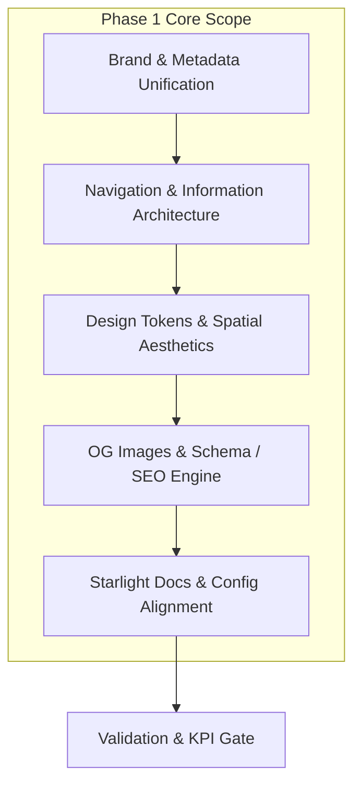

# Phase 1 Implementation Plan: Brand, Navigation & Core Configuration

> **Reference Documents:**
> - Strategic Vision: [`devdocs/idea.md`](file:///Users/shsarma/DEVEL/TESTING/astro-emdash-sqlite-r2-starter/devdocs/idea.md)
> - Architectural Summary: [`devdocs/summary.md`](file:///Users/shsarma/DEVEL/TESTING/astro-emdash-sqlite-r2-starter/devdocs/summary.md)
> - Agent System Guide: [`AGENTS.md`](file:///Users/shsarma/DEVEL/TESTING/astro-emdash-sqlite-r2-starter/AGENTS.md)

---

## 1. Objective & Scope

The objective of **Phase 1** is to establish the complete brand foundation, information architecture, navigation hierarchy, design token calibration, and configuration synchronization for **SREDSOL** ([`sredsol.com`](https://sredsol.com)).

### Core Goal
Transition the starter from a generic marketing SaaS boilerplate into SREDSOL’s official digital platform and exploration gateway without breaking any existing Astro SSR capabilities, EmDash CMS bindings, Starlight documentation, i18n routing, or automated KPI validation rules.



---

## 2. Workstream Breakdown

### Workstream 1: Site Configuration & Brand Metadata Unification

Unify the configuration layer into a single authoritative source of truth, removing discrepancies between [`src/config/site.config.ts`](file:///Users/shsarma/DEVEL/TESTING/astro-emdash-sqlite-r2-starter/src/config/site.config.ts) and [`src/lib/site-config.ts`](file:///Users/shsarma/DEVEL/TESTING/astro-emdash-sqlite-r2-starter/src/lib/site-config.ts).

#### Key Changes:
1. **Site Identity & Metadata**:
   - **Name**: `SREDSOL`
   - **URL**: `https://sredsol.com`
   - **Tagline / Proposition**: *“Technology for Exploration — We build systems that make exploration possible.”*
   - **Description**: *“Computational environments, interactive instruments, and intelligent tools for learning, observation, and creation.”*
   - **Author**: `SREDSOL`
   - **Contact Email**: `contact@sredsol.com`
   - **Social Links**:
     - GitHub: `https://github.com/sredsol`
     - Twitter / X: `https://x.com/sredsol`
     - LinkedIn: `https://linkedin.com/company/sredsol`
2. **Branding & Theme Tokens**:
   - Set neutral monochrome OKLCH palette as brand base.
   - Configure light/dark SVG logo references.
3. **Synchronization**:
   - Ensure `src/lib/site-config.ts` re-exports or derives directly from `src/config/site.config.ts` so `SITE_CONFIG` and `siteConfig` never fall out of sync.

---

### Workstream 2: Information Architecture & Navigation System

Refactor the site structure from SaaS marketing pages (`Services`, `Pricing`) to SREDSOL’s computational exploration pillars.

#### 1. Header Navigation Hierarchy:
* **Primary Navigation Links** ([`src/config/nav.config.ts`](file:///Users/shsarma/DEVEL/TESTING/astro-emdash-sqlite-r2-starter/src/config/nav.config.ts)):
  * **Explorations** (`/explorations`): Interactive catalog of studios, computational spaces, and instruments.
  * **Technology** (`/technology`): System architecture, layer stacks (Mathematics $\rightarrow$ Computation $\rightarrow$ Observation), and open standards.
  * **Thinking** (`/thinking`): CMS-backed research notes, essays, and engineering logs (replaces generic `/blog`).
  * **Company** (`/company`): Philosophy, team, research principles, and contact.
* **Special Action Control**:
  * **`[ ↗ LAB ]`** (`/lab`): Direct entry point to live interactive simulations and experimental sandboxes.
* **Utility Controls**:
  * Global Search (`⌘K` modal)
  * Theme Toggle (`Dark` / `Light`)
  * Language Switcher (`i18n` aware)

#### 2. Footer Navigation Structure:
* **Explorations & Systems**:
  * `LearningOS` (`/explorations/learning-os`)
  * `Physical Computing Studio` (`/explorations/physical-computing`)
  * `Observation Studio` (`/explorations/observation-studio`)
  * `OxiGeo` (`/explorations/oxigeo`)
  * `MathArt` (`/explorations/math-art`)
* **Company & Research**:
  * `About & Philosophy` (`/company`)
  * `Thinking & Notes` (`/thinking`)
  * `Technology Stack` (`/technology`)
  * `Contact` (`/company#contact`)
* **Legal & Meta**:
  * `Privacy Policy` (`/privacy`)
  * `Terms & Conditions` (`/terms`)
  * `System Status` (`/status` or operational badge)
* **Social & Repositories**:
  * `GitHub` (`https://github.com/sredsol`)
  * `Lab Portal` (`/lab`)

#### 3. Internationalization (`i18n`) Dictionary Update:
* Update [`src/i18n/en.json`](file:///Users/shsarma/DEVEL/TESTING/astro-emdash-sqlite-r2-starter/src/i18n/en.json) with all new keys:
  ```json
  {
    "nav.home": "Home",
    "nav.explorations": "Explorations",
    "nav.technology": "Technology",
    "nav.thinking": "Thinking",
    "nav.company": "Company",
    "nav.lab": "LAB",
    "hero.eyebrow": "Computational Systems",
    "hero.title": "We build systems that make exploration possible.",
    "hero.subtitle": "Computational environments, interactive instruments, and intelligent tools for learning, observation, and creation.",
    "hero.ctaPrimary": "Explore Systems",
    "hero.ctaSecondary": "Enter Lab",
    "footer.tagline": "Computational environments, interactive instruments, and intelligent tools.",
    "footer.statusOperational": "Systems Operational"
  }
  ```
* Run [`scripts/validate-i18n.js`](file:///Users/shsarma/DEVEL/TESTING/astro-emdash-sqlite-r2-starter/scripts/validate-i18n.js) to guarantee 100% dictionary integrity.

---

### Workstream 3: Design Tokens & Studio Spatial Aesthetics

Calibrate tokens and styling utilities to reflect SREDSOL’s computational studio visual grammar.

#### 1. Color Tokens ([`src/styles/tokens/colors.css`](file:///Users/shsarma/DEVEL/TESTING/astro-emdash-sqlite-r2-starter/src/styles/tokens/colors.css)):
* Preserve the strict OKLCH monochrome baseline:
  * Light: Surface `--background: oklch(1 0 0deg)`, Foreground `--foreground: oklch(0.145 0 0deg)`.
  * Dark: Surface `--background: oklch(0.145 0 0deg)`, Foreground `--foreground: oklch(0.985 0 0deg)`, Cards `--card: oklch(0.205 0 0deg)`.
* Calibrate functional status tokens (`--info`, `--success`, `--warning`, `--destructive`) for telemetry gauges, scopes, and signal indicators.

#### 2. Spatial Grid & Glow Utilities ([`src/styles/global.css`](file:///Users/shsarma/DEVEL/TESTING/astro-emdash-sqlite-r2-starter/src/styles/global.css)):
* Refine `.bg-grid` to match the fine spatial grid of SREDSOL Studios (hairline grid with radial edge vignette).
* Ensure smooth dark-mode transitions and reduced-motion compliance on animated glows (`.bg-glow`).

#### 3. Brand Monogram & Logo Components:
* **[`src/components/layout/Logo.astro`](file:///Users/shsarma/DEVEL/TESTING/astro-emdash-sqlite-r2-starter/src/components/layout/Logo.astro)**:
  * Clean computational mark `[S]` with monospace styling + `SREDSOL` wordmark.
  * Semantic tokens only (replace any hardcoded inline colors with `var(--primary)`, `var(--primary-foreground)`).
* **[`src/components/ui/marketing/Logo/Logo.astro`](file:///Users/shsarma/DEVEL/TESTING/astro-emdash-sqlite-r2-starter/src/components/ui/marketing/Logo/Logo.astro)**:
  * Update primitive to use semantic tokens (`var(--primary-foreground)` instead of `color: white`).

---

### Workstream 4: OpenGraph, Schema & Documentation Alignment

#### 1. OpenGraph Generator ([`src/lib/og.ts`](file:///Users/shsarma/DEVEL/TESTING/astro-emdash-sqlite-r2-starter/src/lib/og.ts)):
* Update SVG template with SREDSOL typography, domain badge (`sredsol.com`), and spatial grid watermark.
* Dynamic card variants for Explorations, Thinking articles, and Technology blueprints.

#### 2. JSON-LD Structured Identity ([`src/lib/schema.ts`](file:///Users/shsarma/DEVEL/TESTING/astro-emdash-sqlite-r2-starter/src/lib/schema.ts)):
* Configure `Organization` schema for SREDSOL:
  * Name: `SREDSOL`
  * URL: `https://sredsol.com`
  * Description: `Technology for Exploration`
  * Social profiles & Contact points.

#### 3. Starlight Documentation Alignment ([`astro.config.ts`](file:///Users/shsarma/DEVEL/TESTING/astro-emdash-sqlite-r2-starter/astro.config.ts)):
* Update docs title to `SREDSOL Documentation`.
* Update GitHub links to SREDSOL organization repository.
* Update [`src/components/docs/SiteTitle.astro`](file:///Users/shsarma/DEVEL/TESTING/astro-emdash-sqlite-r2-starter/src/components/docs/SiteTitle.astro).

---

## 3. Detailed File-by-File Change Plan

| File Path | Action | Description & Rationale |
| :--- | :--- | :--- |
| [`src/config/site.config.ts`](file:///Users/shsarma/DEVEL/TESTING/astro-emdash-sqlite-r2-starter/src/config/site.config.ts) | **MODIFY** | Update core site metadata, URL (`https://sredsol.com`), description, author, and social links to SREDSOL. |
| [`src/lib/site-config.ts`](file:///Users/shsarma/DEVEL/TESTING/astro-emdash-sqlite-r2-starter/src/lib/site-config.ts) | **MODIFY** | Synchronize `SITE_CONFIG` with `src/config/site.config.ts` to ensure consistency across the codebase. |
| [`src/config/nav.config.ts`](file:///Users/shsarma/DEVEL/TESTING/astro-emdash-sqlite-r2-starter/src/config/nav.config.ts) | **MODIFY** | Define SREDSOL primary nav (`Explorations`, `Technology`, `Thinking`, `Company`, `Lab`) and footer taxonomy. |
| [`src/i18n/en.json`](file:///Users/shsarma/DEVEL/TESTING/astro-emdash-sqlite-r2-starter/src/i18n/en.json) | **MODIFY** | Add SREDSOL navigation keys, hero text, and exploration domain translations. |
| [`src/components/layout/Header.astro`](file:///Users/shsarma/DEVEL/TESTING/astro-emdash-sqlite-r2-starter/src/components/layout/Header.astro) | **MODIFY** | Add the dedicated `[ ↗ LAB ]` action button and update desktop/mobile navigation rendering. |
| [`src/components/layout/Footer.astro`](file:///Users/shsarma/DEVEL/TESTING/astro-emdash-sqlite-r2-starter/src/components/layout/Footer.astro) | **MODIFY** | Restructure footer columns for SREDSOL domains, add system status indicator. |
| [`src/components/layout/Logo.astro`](file:///Users/shsarma/DEVEL/TESTING/astro-emdash-sqlite-r2-starter/src/components/layout/Logo.astro) | **MODIFY** | Implement SREDSOL brand wordmark and computational mark. |
| [`src/components/ui/marketing/Logo/Logo.astro`](file:///Users/shsarma/DEVEL/TESTING/astro-emdash-sqlite-r2-starter/src/components/ui/marketing/Logo/Logo.astro) | **MODIFY** | Fix non-semantic token color (`color: white` $\rightarrow$ `var(--primary-foreground)`). |
| [`src/lib/og.ts`](file:///Users/shsarma/DEVEL/TESTING/astro-emdash-sqlite-r2-starter/src/lib/og.ts) | **MODIFY** | Update OG SVG generation with SREDSOL brand colors and typography. |
| [`src/lib/schema.ts`](file:///Users/shsarma/DEVEL/TESTING/astro-emdash-sqlite-r2-starter/src/lib/schema.ts) | **MODIFY** | Configure Organization schema for SREDSOL. |
| [`astro.config.ts`](file:///Users/shsarma/DEVEL/TESTING/astro-emdash-sqlite-r2-starter/astro.config.ts) | **MODIFY** | Update Starlight title, social links, and repository URLs. |
| [`src/__tests__/lib/schema.test.ts`](file:///Users/shsarma/DEVEL/TESTING/astro-emdash-sqlite-r2-starter/src/__tests__/lib/schema.test.ts) | **MODIFY** | Update unit test expectations for SREDSOL site metadata and organization schema. |

---

## 4. Verification & Quality Guardrails

Every step of Phase 1 execution will be validated against our automated verification suite:

```bash
# 1. Validate i18n dictionary key parity and helper existence
node scripts/validate-i18n.js

# 2. Verify design token compliance and no hardcoded Tailwind palette utilities
node scripts/check-kpis.mjs

# 3. Verify CSS compliance with Stylelint
pnpm run lint:css

# 4. Run Unit Test Suite (Schema, utils, blog helpers)
npx vitest run

# 5. Run Astro TypeScript typecheck
pnpm run type-check

# 6. Validate complete Astro SSR build
pnpm run build
```

---

## 5. Risk Assessment & Mitigation

| Potential Risk | Impact | Mitigation Strategy |
| :--- | :--- | :--- |
| **I18n Translation Key Desync** | Missing strings / failed build | Run `node scripts/validate-i18n.js` immediately after modifying `src/i18n/en.json`. |
| **Off-System Styling Drift** | CI failure on `check:kpis` | Use semantic tokens (`var(--primary)`, `var(--foreground)`, `bg-card`) exclusively; zero `#hex` in `.astro` files. |
| **Broken Starlight / Docs Nav** | Docs build errors | Ensure Starlight sidebar configuration in `astro.config.ts` aligns with existing files in `src/content/docs/`. |
| **OG Image Generation Mismatch** | Broken social cards | Update `src/lib/og.ts` and test `src/pages/og/[...slug].ts` endpoints. |

---

## 6. Execution Checklist

- [ ] **Step 1**: Update [`src/config/site.config.ts`](file:///Users/shsarma/DEVEL/TESTING/astro-emdash-sqlite-r2-starter/src/config/site.config.ts) and [`src/lib/site-config.ts`](file:///Users/shsarma/DEVEL/TESTING/astro-emdash-sqlite-r2-starter/src/lib/site-config.ts) with SREDSOL metadata.
- [ ] **Step 2**: Update [`src/config/nav.config.ts`](file:///Users/shsarma/DEVEL/TESTING/astro-emdash-sqlite-r2-starter/src/config/nav.config.ts) with SREDSOL information architecture (`Explorations`, `Technology`, `Thinking`, `Company`, `Lab`).
- [ ] **Step 3**: Update [`src/i18n/en.json`](file:///Users/shsarma/DEVEL/TESTING/astro-emdash-sqlite-r2-starter/src/i18n/en.json) with new navigation keys and verify with `validate-i18n.js`.
- [ ] **Step 4**: Update [`src/components/layout/Header.astro`](file:///Users/shsarma/DEVEL/TESTING/astro-emdash-sqlite-r2-starter/src/components/layout/Header.astro) (navigation list & `[ ↗ LAB ]` action button).
- [ ] **Step 5**: Update [`src/components/layout/Footer.astro`](file:///Users/shsarma/DEVEL/TESTING/astro-emdash-sqlite-r2-starter/src/components/layout/Footer.astro) (SREDSOL domains & system status badge).
- [ ] **Step 6**: Update [`src/components/layout/Logo.astro`](file:///Users/shsarma/DEVEL/TESTING/astro-emdash-sqlite-r2-starter/src/components/layout/Logo.astro) and [`src/components/ui/marketing/Logo/Logo.astro`](file:///Users/shsarma/DEVEL/TESTING/astro-emdash-sqlite-r2-starter/src/components/ui/marketing/Logo/Logo.astro) with token-clean brand mark.
- [ ] **Step 7**: Update [`src/lib/og.ts`](file:///Users/shsarma/DEVEL/TESTING/astro-emdash-sqlite-r2-starter/src/lib/og.ts) and [`src/lib/schema.ts`](file:///Users/shsarma/DEVEL/TESTING/astro-emdash-sqlite-r2-starter/src/lib/schema.ts).
- [ ] **Step 8**: Update [`astro.config.ts`](file:///Users/shsarma/DEVEL/TESTING/astro-emdash-sqlite-r2-starter/astro.config.ts) docs configuration.
- [ ] **Step 9**: Update unit tests in [`src/__tests__/lib/schema.test.ts`](file:///Users/shsarma/DEVEL/TESTING/astro-emdash-sqlite-r2-starter/src/__tests__/lib/schema.test.ts) to match new SREDSOL site metadata.
- [ ] **Step 10**: Run complete validation suite (`check:kpis`, `lint`, `test`, `build`).
