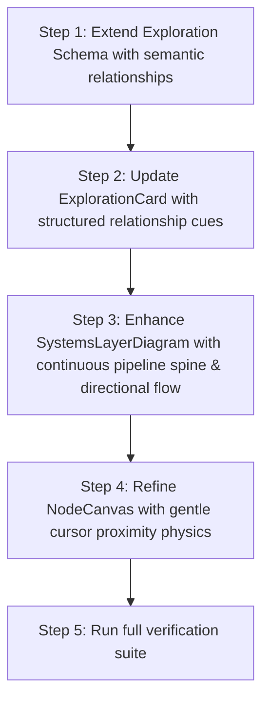

# SREDSOL Semantic Depth & Controlled Interaction Plan
## Implementing Directional Pipeline, Hero Proximity Dynamics & Studio Semantic Cues

> **Document Target**: [`devdocs/semantic-pipeline-and-relationships.md`](file:///Users/shsarma/DEVEL/TESTING/astro-emdash-sqlite-r2-starter/devdocs/semantic-pipeline-and-relationships.md)  
> **Source Review**: [`devdocs/reviews/after-kepler.md`](file:///Users/shsarma/DEVEL/TESTING/astro-emdash-sqlite-r2-starter/devdocs/reviews/after-kepler.md) (Assessment: ~9/10)  
> **Core Directive**: *“Stop making large visual changes. Focus on semantic depth, content relationships, and controlled interaction.”*

---

## 1. Executive Strategy

```
┌─────────────────────────────────────────────────────────────────────────────┐
│               FROM VISUAL POLISH TO SYSTEMIC & SEMANTIC DEPTH                │
├─────────────────────────────────────────────────────────────────────────────┤
│  1. DIRECTIONAL PIPELINE           2. RESTRAINED HERO LIFE  3. SEMANTIC CUES│
│  ───────────────────────           ───────────────────────  ────────────────│
│  Convert the 7-layer list into     Subtle cursor proximity  Expose EmDash   │
│  a continuous vertical execution   damping in vertex mesh   graph relations │
│  pipeline with directional flow    (no 3D spectacle).       on Studio cards.│
└─────────────────────────────────────────────────────────────────────────────┘
```

---

## 2. Detailed Work Packages

### WP-1: Directional Technical Lineage Pipeline
* **Target Files**:
  - [`src/components/sections/SystemsLayerDiagram.astro`](file:///Users/shsarma/DEVEL/TESTING/astro-emdash-sqlite-r2-starter/src/components/sections/SystemsLayerDiagram.astro)
  - [`src/components/ui/layout/SystemLayer/SystemLayer.astro`](file:///Users/shsarma/DEVEL/TESTING/astro-emdash-sqlite-r2-starter/src/components/ui/layout/SystemLayer/SystemLayer.astro)
* **Goal**: Transform the 7-layer vertical list into a visibly connected **top-to-bottom computational pipeline**.
* **Key Enhancements**:
  1. **Continuous Pipeline Spine**:
     Add an architectural vertical spine down the left node axis (`border-left: 2px solid var(--border)` with animated gradient pulse).
  2. **Directional Flow Connectors**:
     Render explicit directional flow markers (`↓ BRIDGE // [Protocol]`) between consecutive nodes:
     $$\text{01 Math} \xrightarrow{\downarrow} \text{02 Comp} \xrightarrow{\downarrow} \text{03 Instruments} \xrightarrow{\downarrow} \text{04 Hardware} \xrightarrow{\downarrow} \text{05 Observation} \xrightarrow{\downarrow} \text{06 Synthesis} \xrightarrow{\downarrow} \text{07 LearningOS}$$
  3. **Node Step Numbering**:
     Encase layer indices (`01`, `02`, etc.) in crisp hexagonal or circular node badges anchored directly to the vertical spine.

---

### WP-2: Hero Proximity Interaction (Restrained Living System)
* **Target Files**:
  - [`src/components/interactive/NodeCanvas.astro`](file:///Users/shsarma/DEVEL/TESTING/astro-emdash-sqlite-r2-starter/src/components/interactive/NodeCanvas.astro)
  - [`src/components/sections/HeroNodeField.astro`](file:///Users/shsarma/DEVEL/TESTING/astro-emdash-sqlite-r2-starter/src/components/sections/HeroNodeField.astro)
* **Goal**: Give the hero vertex mesh a subtle, organic response to mouse proximity without high-CPU 3D overhead.
* **Key Enhancements**:
  1. **Cursor Proximity Damping**:
     When the mouse moves over the hero canvas, vertices within an $80\text{px}$ radius experience gentle magnetic deflection and elastic return.
  2. **Dynamic Transient Wires**:
     Faint hairline connection filaments (`rgba(59, 130, 246, 0.35)`) dynamically form between the cursor and nearest 2-3 vertices.
  3. **Strict Accessibility Guard**:
     Disable all mouse deflection when `prefers-reduced-motion: reduce` is active.

---

### WP-3: Semantic Relationship Cues on Studio Cards
* **Target Files**:
  - [`src/lib/explorations.ts`](file:///Users/shsarma/DEVEL/TESTING/astro-emdash-sqlite-r2-starter/src/lib/explorations.ts)
  - [`src/components/ui/data-display/ExplorationCard/ExplorationCard.astro`](file:///Users/shsarma/DEVEL/TESTING/astro-emdash-sqlite-r2-starter/src/components/ui/data-display/ExplorationCard/ExplorationCard.astro)
* **Goal**: Expose EmDash's structured relationship intelligence directly on the studio cards.
* **Schema Extension in `src/lib/explorations.ts`**:
  ```typescript
  export interface Exploration {
    id: string;
    title: string;
    domain: Domain;
    description: string;
    tags: string[];
    // Semantic relationship intelligence
    relationships: {
      explores: string;      // e.g. "Physical Systems & Embedded Telemetry"
      connects: string[];    // e.g. ["Simulation", "MicroPython", "Sensor Buses"]
      relatedStudio: string; // e.g. "LearningOS"
    };
    researchArticle?: string;
  }
  ```
* **Card UI Integration**:
  Render a compact, high-legibility semantic footer bar inside each card:
  - `EXPLORES // Physical Systems`
  - `CONNECTS // Simulation · MicroPython · Sensor Buses`
  - `RELATED // LearningOS ↗`

---

## 3. Implementation Sequence & Quality Gates



---

## 4. Verification Checklist

1. **Design Tokens & Accessibility**:
   - Zero hardcoded colors or off-system Tailwind palette classes.
   - All interactive transitions respect `prefers-reduced-motion`.
2. **Automated Test Suite**:
   ```bash
   node scripts/validate-i18n.js
   node scripts/check-kpis.mjs
   npx stylelint "src/styles/**/*.css"
   npx vitest run
   ASTRO_TELEMETRY_DISABLED=1 npx astro check
   ASTRO_TELEMETRY_DISABLED=1 npx astro build
   ```
