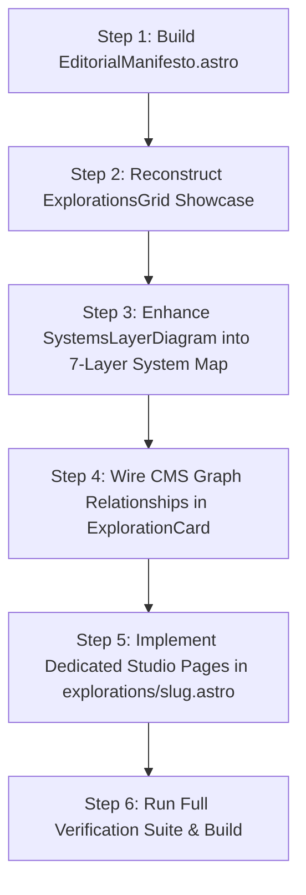

# SREDSOL Next-Phase Implementation Blueprint — Studios & Systems Experience

> **Document Target**: [`devdocs/studios-implementation.md`](file:///Users/shsarma/DEVEL/TESTING/astro-emdash-sqlite-r2-starter/devdocs/studios-implementation.md)  
> **Strategic Intent**: Transition the SREDSOL website from a structured marketing grid into an authoritative, living computational research & technology company experience.  
> **Core Proposition**: *“Technology for Exploration — We build systems that make exploration possible.”*

---

## 1. Architectural Strategy & Visual Grammar

```
┌─────────────────────────────────────────────────────────────────────────────┐
│                      SREDSOL HOMEPAGE SEQUENCE (REFINED)                    │
├─────────────────────────────────────────────────────────────────────────────┤
│ 1. HeroNodeField           — Spatial dark canvas + pointer-reactive vertex  │
│                              proximity mesh + perimeter HUD telemetry       │
│                                   │                                         │
│                                   ▼                                         │
│ 2. DomainGrid              — 4 Pillars with action tri-verbs:               │
│                              COMP (01) · PHYS (02) · OBS (03) · LEARN (04)  │
│                                   │                                         │
│                                   ▼                                         │
│ 3. EditorialManifesto      — [NEW] Open research statement with vertical    │
│                              typographic conduit (Breaks "card fatigue")    │
│                                   │                                         │
│                                   ▼                                         │
│ 4. ExplorationsGrid        — [RESTRUCTURED] Asymmetric centerpiece:         │
│                              Large Physical Computing Studio showcase +     │
│                              flanking satellite studios                     │
│                                   │                                         │
│                                   ▼                                         │
│ 5. SystemsLayerDiagram     — [RESTRUCTURED] 7-Stage Mathematics-to-Empirical│
│                              interactive system progression conduit         │
│                                   │                                         │
│                                   ▼                                         │
│ 6. ThinkingDigest          — Research publications connected to studios     │
│                                   │                                         │
│                                   ▼                                         │
│ 7. LabCTA                  — Direct portal to computational instruments     │
└─────────────────────────────────────────────────────────────────────────────┘
```

---

## 2. Work Package Breakdown

### WP-1: Featured Studio Centerpiece (Asymmetric Studio Showcase)
* **Goal**: Transform the 2×2 exploration card grid into a high-impact asymmetric centerpiece that communicates *“what SREDSOL builds”* at a glance.
* **Component Targets**:
  - [`src/components/sections/ExplorationsGrid.astro`](file:///Users/shsarma/DEVEL/TESTING/astro-emdash-sqlite-r2-starter/src/components/sections/ExplorationsGrid.astro)
  - [`src/components/ui/data-display/ExplorationCard/ExplorationCard.astro`](file:///Users/shsarma/DEVEL/TESTING/astro-emdash-sqlite-r2-starter/src/components/ui/data-display/ExplorationCard/ExplorationCard.astro)
  - [`src/components/interactive/StudioPreview.astro`](file:///Users/shsarma/DEVEL/TESTING/astro-emdash-sqlite-r2-starter/src/components/interactive/StudioPreview.astro)
* **Design & Layout Specification**:
  - **Asymmetric Grid Structure** (`lg:grid-cols-12 gap-6`):
    - **Primary Centerpiece (Left 7–8 Cols)**: *Physical Computing Studio* (or primary featured studio).
      - Heightened interactive canvas viewport (`h-72` / `18rem`).
      - Live HUD instrumentation telemetry bar (Status: `ONLINE // 400kHz I2C`, Scene: `CIRCUIT-SIM-01`).
      - Explicit action methodology pipeline: `Build → Connect → Program → Observe`.
      - Rich technology stack matrix: `Rust · WASM · WebSerial · I2C · Embedded C++`.
      - Direct link to related research publication: `Designing Computational Instruments`.
    - **Flanking Satellite Stack (Right 4–5 Cols)**: *LearningOS*, *Observation Studio*, *OxiGeo & MathArt*.
      - High-density compact vertical stack (`flex flex-col gap-4`).
      - Streamlined micro-scope preview, domain label, one-line summary, and quick exploratory trigger.

```
┌───────────────────────────────────────────────────┬───────────────────────────────┐
│                                                   │ [04 // LEARN]                 │
│  [02 // PHYSICAL SYSTEMS]   ● ACTIVE // 400kHz    │ LearningOS                    │
│  PHYSICAL COMPUTING STUDIO                        │ Cognitive workbench & graph   │
│                                                   ├───────────────────────────────┤
│  ┌─────────────────────────────────────────────┐  │ [03 // OBS]                   │
│  │                                             │  │ Observation Studio            │
│  │     LIVING SYSTEM SIMULATION PREVIEW        │  │ Telemetry & spectral feeds    │
│  │                                             │  ├───────────────────────────────┤
│  └─────────────────────────────────────────────┘  │ [01 // COMP]                  │
│                                                   │ OxiGeo & MathArt              │
│  Action: Build → Connect → Program → Observe      │ Geometric computing engine    │
│  Tech: Rust · WASM · WebSerial · I2C              │                               │
│  Related Thinking: Designing Instruments ↗        │                               │
│  [ Explore Physical Computing Studio → ]          │                               │
└───────────────────────────────────────────────────┴───────────────────────────────┘
```

---

### WP-2: Mathematics-to-Empirical Interactive System Map
* **Goal**: Replace the stacked cards in `SystemsLayerDiagram.astro` with an interactive 7-stage vertical progression map that proves *“SREDSOL connects these layers.”*
* **Component Targets**:
  - [`src/components/sections/SystemsLayerDiagram.astro`](file:///Users/shsarma/DEVEL/TESTING/astro-emdash-sqlite-r2-starter/src/components/sections/SystemsLayerDiagram.astro)
  - [`src/components/ui/layout/SystemLayer/SystemLayer.astro`](file:///Users/shsarma/DEVEL/TESTING/astro-emdash-sqlite-r2-starter/src/components/ui/layout/SystemLayer/SystemLayer.astro)
* **The 7-Layer Progression Architecture**:
  1. `01 // MATHEMATICS` — Continuous & discrete models, differential forms, dynamical systems.
  2. `02 // COMPUTATION` — High-throughput WASM kernels, vector simulation, numerical solvers.
  3. `03 // REACTIVE INTERFACES` — Direct manipulation canvas instruments, visual grammars.
  4. `04 // PHYSICAL SYSTEMS` — Hardware microcontrollers, sensor bridges, physical buses.
  5. `05 // OBSERVATION` — Real-time telemetry acquisition, time-series, spatial observation.
  6. `06 // SYNTHESIS` — Parameter estimation, feedback loops, mathematical modeling.
  7. `07 // LEARNINGOS` — Unified constructivist cognitive environments.
* **Interactive Behavior & Styling**:
  - Continuous vertical signal spine with glowing bus pulse animations.
  - Resting State: Sleek horizontal row displaying layer index, title, and crisp one-line purpose.
  - Hover / Focus State: Expands to reveal formal mathematical foundation, technology bridges, and data input/output contracts.

---

### WP-3: Open Editorial / Manifesto Section
* **Goal**: Break the repetitive cadence of `heading → cards → heading → cards` by introducing an open, high-whitespace research statement.
* **Component Targets**:
  - `[NEW]` [`src/components/sections/EditorialManifesto.astro`](file:///Users/shsarma/DEVEL/TESTING/astro-emdash-sqlite-r2-starter/src/components/sections/EditorialManifesto.astro)
  - [`src/pages/index.astro`](file:///Users/shsarma/DEVEL/TESTING/astro-emdash-sqlite-r2-starter/src/pages/index.astro)
* **Design & Typography Specification**:
  - Spatial Padding: Generous vertical breathing room (`py-28 lg:py-36`).
  - High-Contrast Thesis:
    ```
    “We move from models to systems, and from systems to observation.”
    ```
  - Downward Typographic Conduit:
    $$\text{Mathematical Model} \;\longrightarrow\; \text{Computational System} \;\longrightarrow\; \text{Interactive Environment} \;\longrightarrow\; \text{Physical Experiment} \;\longrightarrow\; \text{Empirical Observation}$$
  - Zero heavy card frames; raw typographic precision on a subtle fine grid backdrop.

---

### WP-4: Surfacing Real CMS Relationships & Knowledge Graph
* **Goal**: Transform studio cards and detail pages into interconnected nodes within SREDSOL's knowledge graph.
* **Component Targets**:
  - [`src/lib/explorations.ts`](file:///Users/shsarma/DEVEL/TESTING/astro-emdash-sqlite-r2-starter/src/lib/explorations.ts)
  - [`src/lib/cms.ts`](file:///Users/shsarma/DEVEL/TESTING/astro-emdash-sqlite-r2-starter/src/lib/cms.ts)
  - [`src/components/ui/data-display/ExplorationCard/ExplorationCard.astro`](file:///Users/shsarma/DEVEL/TESTING/astro-emdash-sqlite-r2-starter/src/components/ui/data-display/ExplorationCard/ExplorationCard.astro)
  - [`src/emdash/sredsol-relationships.ts`](file:///Users/shsarma/DEVEL/TESTING/astro-emdash-sqlite-r2-starter/src/emdash/sredsol-relationships.ts)
* **Metadata Schema & Graph Links**:
  - **Domain Link**: Bidirectional tag mapping studio $\leftrightarrow$ domain page.
  - **Toolchain / Stack**: Structured badges (`Simulation`, `WASM`, `Arduino`, `WebGL`).
  - **Related Thinking**: Direct CMS slug resolution to research publications (`/thinking/[slug]`), fetching title and reading time dynamically from EmDash.

---

### WP-5: Dedicated Studio Exploration Pages (`/explorations/[slug]`)
* **Goal**: Provide dedicated deep-dive computational experience pages for all 5 SREDSOL exploration studios matching the footer navigation and knowledge graph.
* **Component Targets**:
  - `[NEW]` [`src/pages/explorations/[slug].astro`](file:///Users/shsarma/DEVEL/TESTING/astro-emdash-sqlite-r2-starter/src/pages/explorations/[slug].astro)
  - [`src/config/nav.config.ts`](file:///Users/shsarma/DEVEL/TESTING/astro-emdash-sqlite-r2-starter/src/config/nav.config.ts)
  - [`src/emdash/sredsol-explorations.ts`](file:///Users/shsarma/DEVEL/TESTING/astro-emdash-sqlite-r2-starter/src/emdash/sredsol-explorations.ts)
* **5 Studio Targets**:
  1. `/explorations/physical-computing` — Physical Computing Studio (Hardware telemetry, WebSerial, I2C sensor bus).
  2. `/explorations/learning-os` — LearningOS (Constructivist cognitive workbench, SQLite VFS, reactive signals).
  3. `/explorations/observation-studio` — Observation Studio (16-channel telemetry stream, spectral FFT analysis).
  4. `/explorations/oxigeo` — OxiGeo (Continuous spatial geometry, GIS vector topologies).
  5. `/explorations/math-art` — MathArt (Generative topology, dynamical systems, shader canvas).
* **Page Architecture**:
  - Breadcrumbs & Studio Header with domain telemetry HUD indicator.
  - Live Interactive Simulation Viewport (`StudioPreview` with scene IDs `CIRCUIT-SIM-01`, `COGNITIVE-GRAPH-02`, `TELEMETRY-STREAM-03`, `TOPOLOGY-VIZ-04`).
  - Architecture & Kernel Specification cards with `ScopeGauge` telemetry gauges.
  - Knowledge graph mapping (`Explores`, `Connects`, `Companion Studio`).
  - Dynamic research publications conduit linked to EmDash Thinking (`/thinking/[slug]`).
  - Ecosystem navigation to companion studios and direct Lab CTA trigger (`/lab`).

---

## 3. Step-by-Step Implementation Roadmap



### Step 1: Create `EditorialManifesto.astro`
- Create [`src/components/sections/EditorialManifesto.astro`](file:///Users/shsarma/DEVEL/TESTING/astro-emdash-sqlite-r2-starter/src/components/sections/EditorialManifesto.astro) using design tokens only.
- Export from [`src/components/sections/index.ts`](file:///Users/shsarma/DEVEL/TESTING/astro-emdash-sqlite-r2-starter/src/components/sections/index.ts).
- Mount in [`src/pages/index.astro`](file:///Users/shsarma/DEVEL/TESTING/astro-emdash-sqlite-r2-starter/src/pages/index.astro) directly after `<DomainGrid />`.

### Step 2: Implement Studio Showcase in `ExplorationsGrid.astro`
- Provide live canvas simulations via `StudioPreview.astro`.
- Render action methodology pipelines, live HUD chips, and related research publication links.

### Step 3: Upgrade to 7-Stage System Map in `SystemsLayerDiagram.astro`
- Extend layer definitions to 7 complete stages (`01 // MATHEMATICS` through `07 // LEARNINGOS`).
- Refactor `SystemLayer.astro` with animated glowing bus pulse tracks and accessible `tabindex="0"` focus states.

### Step 4: Wire Bidirectional CMS Relationships
- Update `src/lib/explorations.ts` to resolve `relatedArticles` metadata against `src/lib/cms.ts` (`getPostBySlug`).
- Render rich publication preview links directly on exploration cards and `/thinking/[slug]`.

### Step 5: Implement Dedicated Studio Detail Pages
- Create [`src/pages/explorations/[slug].astro`](file:///Users/shsarma/DEVEL/TESTING/astro-emdash-sqlite-r2-starter/src/pages/explorations/[slug].astro) for all 5 studios.
- Align data records in [`src/emdash/sredsol-explorations.ts`](file:///Users/shsarma/DEVEL/TESTING/astro-emdash-sqlite-r2-starter/src/emdash/sredsol-explorations.ts).
- Link exploration cards directly to `/explorations/[slug]`.

### Step 6: Verification & Quality Audits
- Run complete verification pipeline:
  ```bash
  node scripts/validate-i18n.js
  node scripts/check-kpis.mjs
  npx stylelint "src/styles/**/*.css"
  ASTRO_TELEMETRY_DISABLED=1 npx astro check
  ```

---

## 4. Quality & Compliance Constraints (Strict Rules)

1. **Design Tokens Only**: No hardcoded hex/RGB colors, no arbitrary Tailwind palette classes (`bg-zinc-900`, `text-blue-400`). Use semantic tokens only (`bg-card`, `text-foreground`, `border-border`, `text-muted-foreground`).
2. **Accessibility (WCAG AA)**:
   - All interactive nodes must have visible `--ring` focus indicators.
   - Descriptive `aria-expanded` and `aria-label` tags for expanding system layers.
   - Text contrast $\ge 4.5:1$ against dark background canvases.
3. **Motion Guards**: All glowing bus pulses and canvas transitions must be guarded by `@media (prefers-reduced-motion: reduce)`.
4. **Focused Interactivity**: Keep 3D/canvas physics concentrated on the featured studio preview island; avoid redundant background processes.

---

## 5. Verification Checklist

- [x] `EditorialManifesto.astro` renders with clean typographic whitespace and zero horizontal overflow.
- [x] `ExplorationsGrid.astro` displays studio cards with living canvas simulations and methodology pipelines.
- [x] `Physical Computing Studio` centerpiece features living canvas preview, action methodology, and related article link.
- [x] `SystemsLayerDiagram.astro` displays all 7 architecture stages with bridge protocols and glowing bus pulse tracks.
- [x] Dedicated studio pages live at `/explorations/[slug]` for all 5 footer studios (`physical-computing`, `learning-os`, `observation-studio`, `oxigeo`, `math-art`).
- [x] CMS bidirectional links navigate seamlessly between `/explorations`, `/explorations/[slug]`, and `/thinking/[slug]`.
- [x] 0 errors across TypeScript (`astro check`), KPI audits (`check-kpis.mjs`), i18n validator, and CSS stylelint.
