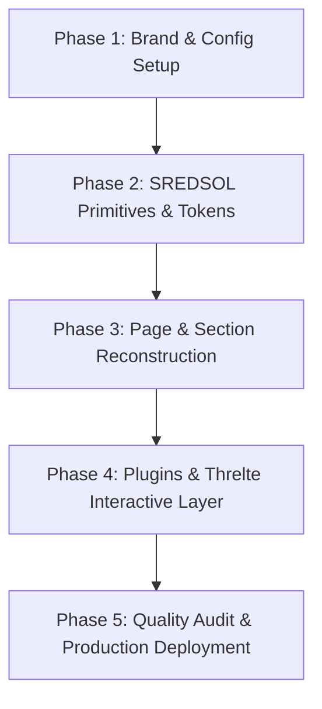

# SREDSOL — Website Transformation Summary & Architecture Blueprint

This document synthesizes the strategic vision from [`devdocs/idea.md`](file:///Users/shsarma/DEVEL/TESTING/astro-emdash-sqlite-r2-starter/devdocs/idea.md) with the codebase architecture of [`astro-emdash-sqlite-r2-starter`](file:///Users/shsarma/DEVEL/TESTING/astro-emdash-sqlite-r2-starter/package.json), establishing the comprehensive blueprint for transforming this generic starter into the official **SREDSOL** website.

---

## 1. Executive Summary & Brand Philosophy

### The Core Shift
Most technology websites are marketing brochures *about* a company. SREDSOL will be an **interactive exploration of the computational systems it builds**.

* **Company**: SREDSOL
* **Tagline / Core Proposition**: *“Technology for Exploration”* / *“We build systems that make exploration possible.”*
* **Mission**: Creating computational environments, interactive instruments, and intelligent tools for learning, observation, and creation.
* **Core Domains**:
  1. **COMPUTATION**: Mathematics, simulation, algorithmic visualization, generative models.
  2. **PHYSICAL SYSTEMS**: Circuits, robotics, sensors, edge devices, hardware-software bridges.
  3. **OBSERVATION**: Data telemetry, scientific experiments, geography, astronomy, time-series streams.
  4. **LEARNING**: Interactive cognitive environments, unified learning spaces, **LearningOS**.

---

## 2. Studio Visual Grammar $\rightarrow$ Website Design System

Instead of manufacturing an artificial corporate aesthetic, SREDSOL abstracts the visual vocabulary of its actual software tools (Physical Computing Studio, Observation Studio, LearningOS, OxiGeo, MathArt):

| Studio Interface Element | Website Design Element | Implementation in Codebase |
| :--- | :--- | :--- |
| **Workspace Background** | Spatial dark canvas with fine grid | CSS Grid pattern (`--color-border` hairline overlay on `--background`) |
| **Concept Nodes** | Interactive topics / system vertices | `<NodeIndicator />` primitive with state rings |
| **Connection Wires** | Relational paths & pipelines | SVG bezier connectors & canvas pipelines |
| **Scopes & Telemetry** | Metrics & live instrumentation | `<ScopeGauge />` and `<SignalBadge />` components |
| **Circuit Blocks** | Modular capabilities / explorations | `<ExplorationCard />` with reactive state |
| **Active Simulation** | Interactive 3D / canvas fields | Lightweight Svelte / Threlte canvas instances |

---

## 3. The Three Clean Architectural Layers

```
                               SREDSOL.COM
                                    │
                    ┌───────────────┴───────────────┐
                    │                               │
             ASTRO (SSR / UI)              EMDASH (Content CMS)
                    │                               │
            SREDSOL Design System            Content & Intelligence Engine
                    │                               │
         ┌──────────┴──────────┐            ┌───────┴──────────────┐
         │                     │            │                      │
   Astro Components    Svelte / Threlte  Core CMS Tables    Sandboxed Plugins
   (Primitives &       (Interactive      (Posts, Pages,    (Explorations, SEO,
    Sections)           Fields)           Media, Tags)      Relationships)
         │                     │            │                      │
         └────────────── Semantic Binding ──┴──────────────────────┘
```

1. **EmDash (Content & Knowledge Engine)**:
   * *Question answered*: *“What does SREDSOL know?”*
   * Manages structured knowledge, articles (Thinking), exploration metadata, and content relationship graphs in SQLite + Cloudflare R2.
2. **Astro (Presentation & Fast Delivery)**:
   * *Question answered*: *“How does SREDSOL present it?”*
   * Delivers server-rendered HTML with zero hydration overhead for static content, instant page transitions, SEO/JSON-LD, and strict design token compliance.
3. **Svelte / Threlte (Interactive Computation)**:
   * *Question answered*: *“How do visitors experience what SREDSOL builds?”*
   * Powers selective, high-impact interactive systems (Hero node network, Exploration card previews, Lab portal).

---

## 4. EmDash Sandboxed Plugins Strategy

Sandboxed plugins run in an isolated runtime (via `@emdash-cms/sandbox-workerd` in Docker/Dokploy) with capability-gated security (`content:read`, `taxonomies:read`, isolated KV storage).

### Key SREDSOL Plugins:

1. **`sredsol-explorations` (Sandboxed)**:
   * Maintains the typed catalog of SREDSOL explorations (LearningOS, Physical Computing Studio, Observation Studio, OxiGeo, MathArt).
   * Schema: `id`, `slug`, `title`, `description`, `domain`, `status` (`active` | `lab` | `archived`), `sceneId`, `technologies[]`, `relatedContent[]`.
   * Exposes internal API route `/_emdash/api/plugins/sredsol-explorations/list` and Block Kit admin dashboard.
2. **`sredsol-seo` (Sandboxed)**:
   * Hooks into `page:metadata` to dynamically inject structured JSON-LD schemas (`Organization`, `SoftwareApplication`, `TechArticle`, `CreativeWork`).
3. **`sredsol-relationships` (Sandboxed)**:
   * Hooks into `content:afterSave` to build bidirectional relationship graphs between Thinking articles and Explorations/Domains.
4. **`sredsol-renderer` (Native / Build-time Plugin)**:
   * Registers custom Portable Text blocks in the CMS (e.g., `<interactive-scene scene="physical-computing" />`) and resolves them to Astro/Svelte components during build/SSR.

---

## 5. Information Architecture & Navigation

### Primary Navigation
* **Brand**: `SREDSOL` (Monogram / Wordmark)
* **Main Links**:
  * `Explorations` (`/explorations`) — Directory of studios, interactive environments, and tools.
  * `Technology` (`/technology`) — Systems stack, architectural layers, and open standards.
  * `Thinking` (`/thinking`) — Research notes, essays, and engineering logs (managed via EmDash).
  * `Company` (`/company`) — Philosophy, research principles, team, and contact.
* **Header Actions**: `[ ↗ LAB ]` button (quick portal to interactive demos), Global Search (`⌘K`), Theme Toggle (`Dark` / `Light`).

---

## 6. Homepage Blueprint (`src/pages/index.astro`)

```
┌─────────────────────────────────────────────────────────────┐
│ SREDSOL            Explorations   Technology   Thinking     │ [ ↗ LAB ]
└─────────────────────────────────────────────────────────────┘
                               │
 1. HERO SECTION
    - Monospace Eyebrow: "SREDSOL COMPUTATIONAL SYSTEMS"
    - Headline: "We build systems that make exploration possible."
    - Subheadline: "Computational environments, interactive instruments,
                   and intelligent tools for learning, observation, and creation."
    - Visual: Interactive Node Field (Cursor-reactive nodes & connection graph)
    - Action: [ Explore Systems → ]  [ Enter Lab ]
                               │
 2. WHAT WE EXPLORE (4 Core Domains)
    - COMPUTATION: Mathematics, simulation, visualization
    - PHYSICAL SYSTEMS: Circuits, robotics, sensors, edge hardware
    - OBSERVATION: Telemetry, experiments, geography, astronomy
    - LEARNING: Interactive environments & LearningOS
                               │
 3. SELECTED EXPLORATIONS (Interactive Cards with Micro-Scenes)
    ┌─────────────────────────┐   ┌─────────────────────────┐
    │ PHYSICAL COMPUTING      │   │ LEARNINGOS              │
    │ Circuit & Logic Studio  │   │ Unified Exploration OS  │
    └─────────────────────────┘   └─────────────────────────┘
    ┌─────────────────────────┐   ┌─────────────────────────┐
    │ OBSERVATION STUDIO      │   │ OXIGEO / MATHART        │
    │ Telemetry & Sensor Flow │   │ Spatial & Generative    │
    └─────────────────────────┘   └─────────────────────────┘
                               │
 4. THE SYSTEMS (Vertical Layer Diagram)
    MATHEMATICS ──→ COMPUTATION ──→ INTERACTION ──→ OBSERVATION ──→ UNDERSTANDING
                               │
 5. THINKING (CMS-Driven Research & Articles)
    - "Why observation matters before explanation"
    - "Designing interactive computational environments"
    - "From simulation to physical experiment"
    - "Building LearningOS offline-first"
                               │
 6. LAB INVITATION CTA (Inverted Surface Band)
    - "There is always another system to build."
    - [ Enter the Lab → ]  [ Read our Thinking ]
                               │
 7. FOOTER
    - System Status Indicator (Operational / Latency)
    - Monospace Links, EmDash CMS link, Copyright, RSS, Sitemap
```

---

## 7. Phased Implementation Plan



### Phase 1: Brand & Config Setup
* Update `src/config/site.config.ts` (SREDSOL identity, metadata, URLs, OG images).
* Update `src/config/nav.config.ts` (`Explorations`, `Technology`, `Thinking`, `Company`, `Lab`).
* Verify i18n translation keys in `src/i18n/ui.ts`.

### Phase 2: SREDSOL Design Primitives
* Refine tokens in `src/styles/tokens/` for SREDSOL's spatial dark grid aesthetic.
* Create primitives in `src/components/ui/sredsol/`:
  * `GridBackground.astro`
  * `NodeIndicator.astro`
  * `SignalBadge.astro`
  * `ScopeGauge.astro`
  * `SystemLayer.astro`

### Phase 3: Sections & Page Reconstruction
* Rebuild `src/pages/index.astro` using SREDSOL sections.
* Create `src/components/sections/sredsol/`:
  * `HeroNodeField.astro`
  * `DomainGrid.astro`
  * `ExplorationsGrid.astro`
  * `SystemsLayerDiagram.astro`
  * `ThinkingDigest.astro`
  * `LabCTA.astro`
* Update `src/registry.json` to reflect all new components and sections.

### Phase 4: Plugins & Interactive Layer
* Implement `sredsol-explorations` sandbox plugin and seed exploration entries in SQLite.
* Add Svelte + `@threlte/core` integration for interactive node scenes.
* Connect EmDash blog collection to the `/thinking` route.

### Phase 5: Verification & Deployment
* Run `pnpm lint`, `pnpm run check:kpis`, `pnpm run lint:css`, `pnpm build`.
* Validate Docker build and Dokploy deployment with SQLite persistence + R2 storage.
